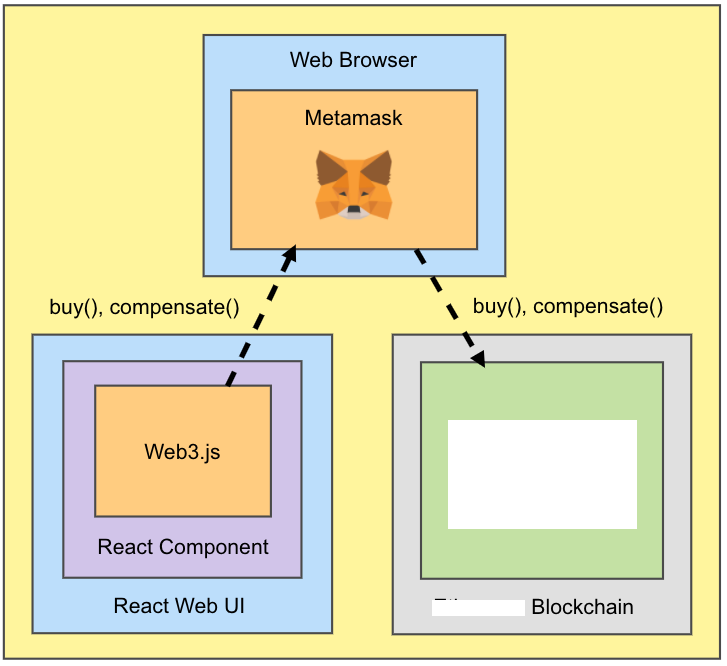

# Tech stack

<figure><figcaption></figcaption></figure>

### Frontend&#x20;

The web UI was built with React and the smart contract was integrated using web3.js

### Blockchain

The Kewaa smart contract was built with solidity using EIP 1633 - an implementation of EIP 721 and ERC 20.&#x20;

### Client

Metamask was used as a wallet to sign and approve transactions.
